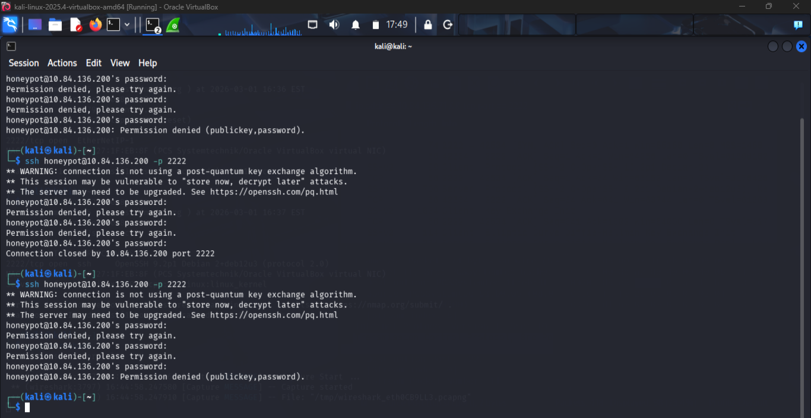
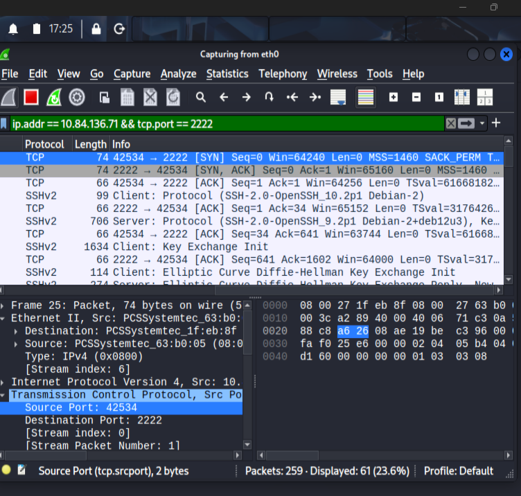
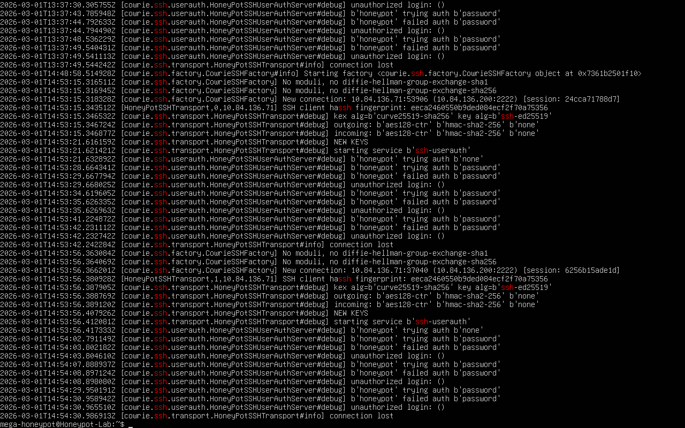
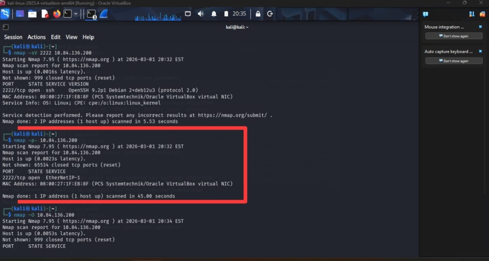
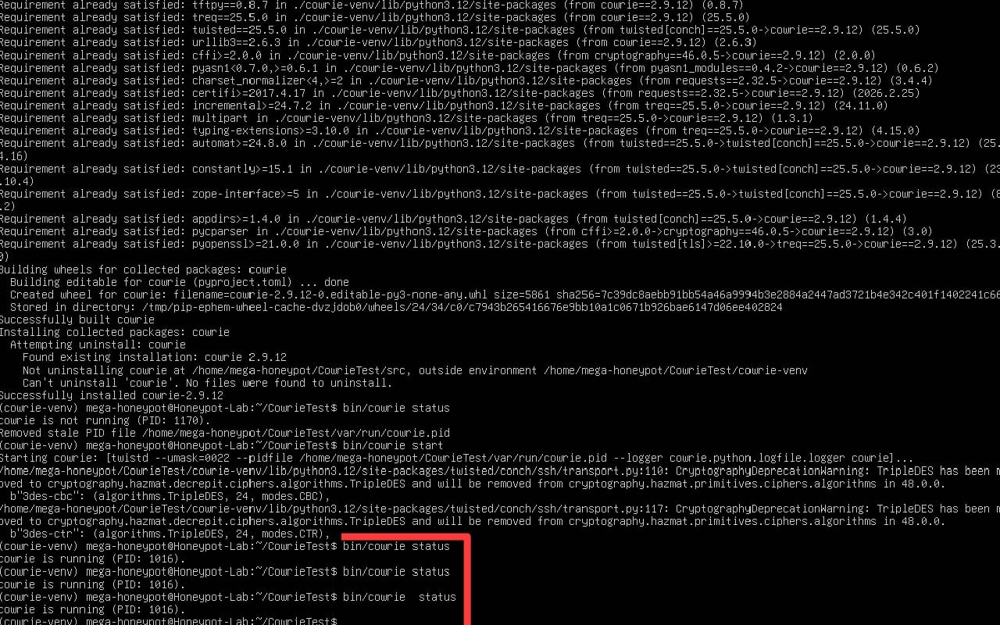

# Cowrie SSH Honeypot Lab

---

## Table of Contents

1. [Overview](#overview)
   
2. [Objective](#objective)
   
3. [Lab Setup](#lab-setup)
   
4. [Attack Simulation](#attack-simulation)
   
5. [Network Traffic Analysis](#network-traffic-analysis)
    
6. [Cowrie Logs Analysis](#cowrie-logs-analysis)
    
7. [Nmap Scan](#nmap-scan)
   
8. [Defense Recommendations](#defense-recommendations)
    
9. [Results and Conclusion](#results-and-conclusion)

10. [Key Takeaways](#key-takeaways)
    
---

## Overview

This lab documents the deployment of a **Cowrie SSH honeypot** to simulate SSH attacks and capture network traffic. The honeypot environment allows monitoring attack attempts, inspecting TCP handshakes and SSH key exchanges, and analyzing log data.

---

## Objective

- Deploy a Cowrie SSH honeypot.

- Simulate SSH attacks from a separate machine.
  
- Capture network traffic with Wireshark.
  
- Scan the honeypot using Nmap.
  
- Analyze attack attempts for source IPs, connection patterns, and protocol behavior.

---

## Lab Setup

| Component | Configuration |
|-----------|---------------|
| Honeypot VM | Ubuntu 22.04, Cowrie running on port 2222 |
| Attacker VM | Kali Linux |
| Network | VirtualBox Host-only |
| Honeypot IP | 10.84.136.200 |
| Attacker IP | 10.84.136.71 |
| Tools | Cowrie logs, Wireshark, Nmap |

---

## Attack Simulation

1. SSH login attempts initiated from the attacker machine to the honeypot.
   
2. Cowrie responded as a real SSH server, logging all connection attempts.
   
3. Network traffic captured included:
   
   - TCP handshake (SYN, SYN-ACK, ACK)
     
   - SSH Key Exchange (Init/Reply)
     
   - ACK packets during encrypted session
     
   - Session termination (FIN, ACK)

   

---

## Network Traffic Analysis

- TCP handshake: client sends SYN, server responds with SYN-ACK, client completes with ACK.
  
- SSH Key Exchange: client initiates, server replies.
  
- FIN and ACK packets indicate session closure.
  
- Multiple ACK-only packets observed during encrypted session.
  
- Source/destination IPs swap normally during request/response interactions.

---

## Cowrie Logs Analysis

- Cowrie recorded all SSH login attempts in real time.
  
- Source IP of attacks: `10.84.136.71`.
  
- Logs include timestamps and connection metadata.

---

## Nmap Scan

- Nmap confirmed port **2222** open on the honeypot.

- Example scan command:

  **nmap -p 2222 10.84.136.200**

  
  
---

## Defense Recommendations

- Restrict SSH access with firewall rules
  
- Use non-default SSH ports
  
- Implement SSH key authentication
  
- Monitor logs and deploy honeypots for early detection

  ---
  
## Results and Conclusion

- Cowrie successfully captured SSH attacks and logged all connection attempts.

- Traffic analysis verified TCP handshakes, SSH key exchanges, ACK packets, and session termination.

- Nmap confirmed the honeypot port was open and listening.

- Demonstrates practical blue-team skills: honeypot deployment, traffic monitoring, and log analysis.

---

## Key Takeaways

- Hands-on simulation improved understanding of TCP and SSH communication beyond theoretical learning.
  
- Correlating Cowrie logs with Wireshark captures demonstrated the value of analyzing multiple data sources during investigations.
  
- Viewing packet captures as system-to-system communication simplifies network traffic analysis.
  
- Honeypots provide a safe environment to observe attacker interaction without exposing real infrastructure.
  
- Troubleshooting configuration and connectivity issues reinforced practical blue-team problem-solving skills.
